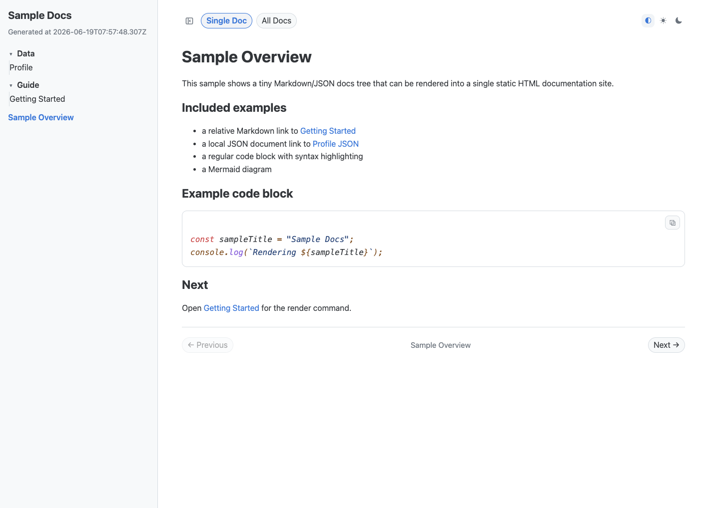

# Markdown Render HTML

[한국어 README](./Readme_kr.md)

`markdown_render_html` is a Deno-based utility that turns a Markdown/JSON
document tree into a single static HTML documentation site with:

- sidebar navigation
- single-doc / all-docs view modes
- internal link rewriting for local Markdown links
- syntax highlighting
- Mermaid diagram rendering
- copy buttons for code blocks
- light / dark / system theme support

## What this repository contains

```text
markdown_render_html/
├── docs/
│   └── assets/index.png
├── sample/
│   ├── deploy-output.sh
│   └── docs/
│       ├── 00-overview.md
│       ├── data/profile.json
│       └── guide/getting-started.md
├── render-doc-html.ts
├── Readme.md
└── Readme_kr.md
```

This repository ships the renderer itself plus a small `sample/` docs tree you
can render locally. Project-specific presets, deploy scripts, and output
directories should live in the consuming repository.

## Requirements

- Deno 2.x
- Network access when rendering
  - Deno downloads npm dependencies on first use
  - the renderer downloads Prism and Mermaid runtime assets into `output/assets/`

## Install Deno

### macOS / Linux

```bash
curl -fsSL https://deno.land/install.sh | sh
```

### Homebrew

```bash
brew install deno
```

### Windows PowerShell

```powershell
irm https://deno.land/install.ps1 | iex
```

### Verify

```bash
deno --version
```

## Quick start

```bash
git clone https://github.com/keispace/markdown_render_html.git
cd markdown_render_html

deno run -A ./render-doc-html.ts \
  --input /path/to/docs \
  --output /path/to/docs/output/index.html \
  --title "Project Docs"
```

Generated files:

- `/path/to/docs/output/index.html`
- `/path/to/docs/output/index.css`
- `/path/to/docs/output/assets/*.js`

## Run the included sample

```bash
deno run -A ./render-doc-html.ts \
  --input ./sample/docs \
  --output ./sample/output/index.html \
  --title "Sample Docs"
```

Then open `./sample/output/index.html` in a browser.

- Public preview: deploy the sample to your own Surge domain if you want a shared URL.
- Screenshot:



Deploy the rendered sample output to Surge:

```bash
printf '%s\n' 'your-project.surge.sh' > ./sample/output/CNAME
./sample/deploy-output.sh
```

The script reads the target domain from `./sample/output/CNAME` and runs `surge`
with the output directory only. Replace `your-project.surge.sh` with your own
Surge domain.

## CLI options

| Option | Description | Default |
| --- | --- | --- |
| `--input <path>` | Source root to scan | `./` |
| `--output <path>` | Output HTML path | `./output/index.html` |
| `--exclude <pattern>` | Gitignore-style exclude pattern, repeatable | `_*.md`, `.*`, `**/.*/**` |
| `--title <text>` | HTML `<title>` and sidebar title | `Render Docs` |

## Supported input

- `*.md`
- `*.json`

Anything else should be wrapped in Markdown if you want it rendered as part of
the docs.

## Default behavior

1. Recursively scans the input root for Markdown and JSON files.
2. Applies exclude patterns before descending into directories.
3. Uses the first H1 as the document title when available.
4. Renders JSON files as fenced JSON code blocks.
5. Extracts CSS into a sibling `.css` file.
6. Downloads Prism and Mermaid runtime JS files into `output/assets/`.
7. References only local runtime assets from the generated HTML.

## Authoring rules

### Titles and labels

- Prefer a clear H1 in each Markdown file.
- If a label looks wrong, fix the file name, folder name, or H1.
- Do not rely on renderer-side special casing for project-specific naming.

### Links

- Use standard Markdown links.
- Prefer explicit relative links such as:

```md
[Schema](./contract/schema.md#basic-structure)
```

- Local `.md` and `.json` links are rewritten to generated internal anchors.
- Extensionless local links are also supported:

```md
[Schema](./contract/schema)
```

- External `http(s):`, `mailto:`, `//`, and absolute `/...` links are left as-is.
- Links that are not rewritten to internal doc anchors open in a new tab.

### Internal notes

- Put internal notes you do not want rendered into files matching `_*.md`.
- Dot-hidden paths are excluded by default as well.

## Mermaid and code blocks

- Regular code blocks get copy buttons.
- Mermaid fenced blocks such as ```` ```mermaid ```` render as SVG diagrams.
- If Mermaid rendering fails, the original source block remains visible.

## Output behavior

The generated site includes:

- sidebar tree navigation
- single-doc / all-docs mode
- previous / next doc navigation
- internal hash navigation
- code copy buttons
- Prism highlighting
- Mermaid diagrams
- light / dark / system themes

## Example preset in a consuming repository

```bash
deno run -A /path/to/markdown_render_html/render-doc-html.ts \
  --input /path/to/docs \
  --output /path/to/docs/output/index.html \
  --exclude index.md \
  --exclude '**/private/**' \
  --title 'Project Docs'
```

## Deployment (optional)

The renderer only generates static files, so you can publish the output with any
static host. If you want a very simple CLI-based option, [Surge](https://surge.sh/)
is a good fit for quickly publishing a single output directory.

```bash
npm install --global surge
surge /path/to/docs/output your-project.surge.sh
```

That uploads the generated `index.html`, `index.css`, and `assets/` directory as-is.

## Limitations

- Build-time network access is currently required.
- Only Markdown and JSON are rendered directly.
- Unresolved local links do not yet emit a separate warning report.
