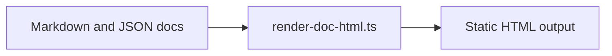

# Getting Started

Back to [Sample Overview](../00-overview.md).

## Run the renderer

```bash
deno run -A ./render-doc-html.ts \
  --input ./sample/docs \
  --output ./sample/output/index.html \
  --title "Sample Docs"
```

After rendering, open `./sample/output/index.html` in a browser.

## Render flow



## Related data

See [Profile JSON](../data/profile.json).
